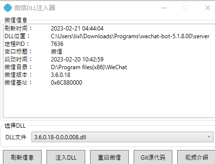
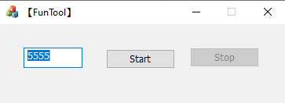

<h1 align="center">ChatGPT-weBot</h1>


[TOC]

使用基于 ChatGPT (非API-KEY调用) 、Stable Diffusion AI画图 与 官方微信hook接口 的 ChatGPT-weBot机器人。中文文档 | [English](./Readme.md)

<div align="center">  </div>

###### 作者

[Snapdragon Lee (github.com)](https://github.com/SnapdragonLee)

*封面来自 [DALL·E2 (openai.com)](https://labs.openai.com/)*


## 支持和特点

- [x] 支持对话
- [x] 支持上下文感知问答
- [x] 支持多线程 `Stable Diffusion` AI 画图功能（仅英语）
- [x] **使用官方微信软件执行，信息来源方面永不封禁**
- [x] 设置关键字在私聊中唤醒微信机器人
- [x] 设置关键字在群聊中唤醒微信机器人
- [x] 在群聊中提到您的机器人时，支持回复@的消息**（有Bug）**
- [x] 支持获取帮助文档
- [x] 设置关键字以重置之前的对话
- [x] 重新生成答案
- [x] 回滚对话
- [ ] 支持多账户多线程对话回答
- [ ] 其他


## 默认配置 （请在启动前仔细阅读，所有配置文件在.config中）

```
{
  // 本地host运行地址（仅本地）
  "server_host": "127.0.0.1:5555",

  // 是否开启ChatGPT自动回复
  "autoReply": true,
  // 在群聊中设置唤醒机器人关键词
  "groupChatKey": "-c",
  // 在群聊中响应回复
  "grpReplyMode": false,
  // 在群聊回答前添加源问题格式
  "grpCitationMode": true,
  // 在私聊中设置唤醒机器人关键词
  "privateChatKey": "-c",
  // 在私聊中响应回复
  "prvReplyMode": true,
  // 在群聊回答前添加源问题格式
  "prvCitationMode": false,
  
  // 是否开启 Stable Diffusion 图片回复（仅英语）
  "stableDiffRly": true,
  // 在群聊中设置唤醒 AI画图功能关键词
  "groupImgKey": "-i",
  // 在私聊中设置唤醒 AI画图功能关键词
  "privateImgKey": "-i",
  // 是否开启图片缓存（开启后会在 .cache 文件夹中缓存）
  "isCached": true,

  // 查看可用命令帮助
  "helpKey": "-h",
  // 设置重置上下文关键词
  "resetChatKey": "-rs",
  // 设置重新生成答案关键词
  "regenerateKey": "-rg",
  // 设置回滚到以前的n个问题关键词
  "rollbackKey": "-rb"
}
```


## 启动步骤

1. 安装 `requirements.txt` 中列出的所有包，使用如下命令：

   ```
   pip install -r ./requirements.txt
   ```

   

2. 从 Github Releases 下载需要的包。

3. 在您的计算机上安装 `WeChat-3.6.0.18.exe`，**如果您正在使用的微信版本高于3.6.0.18，可以降级覆盖安装。** 之后请登陆您的微信。您也可以下载 zip 版本的微信，**如果您想要实现微信双开，根据批处理注释修改 `./dual-start.bat` 。**

   

4. 运行服务器监控微信消息。这里有两种方法可以实现，请 ***二选一***：

   - 打开名字为 `DLLinjector_V1.0.3.exe` 的注入器，然后选择文件名为 `3.6.0.18-0.0.0.008.dll` 并注入。

     

     

   - 运行 `funtool_3.6.0.18-1.0.0013.exe` ，后点击 `Start` 。

     

5. 在 `.config/` 目录下填写 JSON 文件。

   - 在 `config.json` 中，您需要根据自己的偏好配置自定义选项。

   - 在 `rev_config.json` 中，您需要通过*选择下面其中一种方法* 来填写 ChatGPT 登录信息：

     - 电子邮件/密码 **（不支持 Google/Microsoft 帐户）**

     - session_token **（支持 Google/Microsoft 帐户）**

       > 1. 进入 [`chat.openai.com/chat`](https://chat.openai.com/chat) 并登录或注册。
       > 2. 按 `F12` 打开开发工具。
       > 3. 将 cookie 中的 `__Secure-next-auth.session-token` 项复制。

6. 运行以下命令启动服务：

   ```
   python main.py
   ```

   **一切准备就绪，欢迎使用 ChatGPT-weBot！** 

   没有限制、没有使用计数，也没有付费要求。


## 常见问题解答

1. 如何获取所有的回复？您可以用您的语言说 “请继续”。
2. 遇到问题了吗？随时来创建一个 issue 进行发布。
3. 如何才能在多线程的程序中定位问题？使用 print 或使用debug工具查看线程栈信息
4. 是否有一些功能预览的图片？有的，在这里 -> [功能预览](./Preview.md)


## 已经 star 本仓库的用户

[](https://github.com/SnapdragonLee/ChatGPT-weBot/stargazers)


## star 用户数量 / 时间变化图

[](https://starchart.cc/SnapdragonLee/ChatGPT-weBot) 


## 日志

- 2023年3月4日 添加了 Stable Diffusion AI 作图功能（仅英语）
- 2023年3月3日 添加多线程，并重写了程序的结构
- 2023年2月27日 添加压缩包版微信与双开脚本，并修复响应关键字为空时无法进行其他操作的 bug
- 2023年2月25日 `config.json` 中添加回答前引用原问题选项
- 2023年2月25日 完成所有功能的 API 函数并修复了其它的错误
- 2023年2月23日 完成了一些在功能列表中列出的 API 并进行了部分调试
- 2023年2月23日 修复连接到逆向服务器时的数据流问题
- 2023年2月21日 报告 ChatGPT API 的问题
- 2023年2月20日 发布 v0.90-dev 版本，在微信上可以与 ChatGPT 进行基本的对话 
- 2023年2月17日 开始开发流程


###### 参考

- [AutumnWhj/ChatGPT-wechat-bot: ChatGPT for wechat](https://github.com/AutumnWhj/ChatGPT-wechat-bot)
- [cixingguangming55555/wechat-bot: 带二次开发接口的PC微信聊天机器人](https://github.com/cixingguangming55555/wechat-bot)

