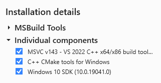
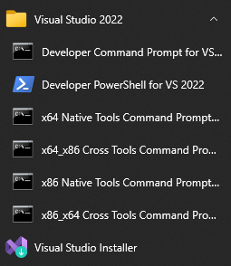

# WxInject 编译

[TOC]

对于大部分人来说，很少接触到 **汇编/C/C++** 等语言的编程。对于这些语言的编译链接来说，工具链非常重要。很多人想临时开发的用户基本都没有安装 `Visual Studio`、`vcpkg` 等工具。下面说下如何从零开始最快速地配置工具链，并自行编译 `WxInject`，从而满足自定义代码的需求。


## 一、安装 Visual Studio Build Tools

*如果你已经安装了 Visual Studio 完整工具链，可以跳过这个步骤。*

如果你的电脑上没有安装过 `Visual Studio`，你可以选择安装最全的 `Visual Studio`；如果你有可替代的 IDE 存在（例如 CLion）也可以选择仅仅安装 `Visual Studio Build Tools`。这里讲解后者，因为空间占用小，安装速度快。

1. 下载 `Visual Studio Build Tools` 并安装。[Microsoft C++ Build Tools - Visual Studio](https://visualstudio.microsoft.com/visual-cpp-build-tools/)

2. 安装后快速启动栏中打开 `Visual Studio Installer`，会让你选择下载组件。在顶端的 `Individual components` 选项中 **最少选择** 这 3 个即可：

   `C++ CMake tools for Windows`；

   `MSVC v143 - VS 2022 C++ x64/x86 build tools (Latest)`；

   `Windows 10/11 SDK`（SDK 后面括号中选择的是内核版本，可以在 **设置(Settings) -> 系统(System) -> 关于(About)** 中找到。**例如内核如果是 Win10 21H2，就选择 Windows 10 SDK (10.0.19041.0) 就可以了；如果内核是 Win 11 的 21H2，则选择 Windows 11 SDK (10.0.22000.0) 即可。**下图是我的 Win10 内核版本截图）

   

   

   独立组件选择后右侧栏应显示为：

   

   选择好后右下角 `Install` 即可。

3. 安装好以后，检查快速启动中是否为以下结构：

   

   如果出现了 `x64 Native Tools Command Prompt` 且能正常打开，即安装成功。

   

## 二、安装 vcpkg 和 开发库

下面由于用到 C/C++ 共享开发库，因此使用 vcpkg 进行管理。

1. 直接从 Github 将 vcpkg 克隆到你想要的位置：

   ```bash
   git clone https://github.com/microsoft/vcpkg
   ```

2. 构建 vcpkg 运行程序：

   ```bash
   .\vcpkg\bootstrap-vcpkg.bat
   ```

3. 安装 `detours`, `nlohmann-json` 共享库：

   ```bash
   .\vcpkg\vcpkg install detours:x64-windows 
   .\vcpkg\vcpkg install nlohmann-json:x64-windows
   ```

4. 回到本文件所在目录，如果最开始克隆 `webot-chatgpt` 的时候没有使用 `--recursive` 参数（即目前目录下有 `spdlog` 文件夹），则需要在本步骤更新子库 `spdlog`：

   ```bash
   git submodule init
   git submodule update
   ```

   

## 三、CMake 构建

使用 `Visual Studio Build Tools` 中的 CMake 尝试构建 `wxinject.dll` 文件。

1. 在快速启动中找到 `x64 Native Tools Command Prompt` ，启动后 **将目录换到本文件的目录**：

   ```bash
   cd {Project_DIR}/wxinject/
   ```

2. 修改目录：请在本文将目录下的 `CMakeLists.txt` 中的第 **13**、**14** 行更改路径：

   **将 `path/to/vcpkg.cmake` 替换为：`{vcpkg_install_DIR}/scripts/buildsystems/vcpkg.cmake`**；

   **还需将 `path/to/vcpkg/lib_root` 替换为：`{vcpkg_install_DIR}/installed/x64-windows` 。** 

   **其中：`{vcpkg_install_DIR}` 为 vcpkg 的安装目录。**

3. 启动构建：

   ```bash
   cmake -DCMAKE_C_COMPILER=cl.exe -DCMAKE_CXX_COMPILER=cl.exe -DCMAKE_ASM_MASM_COMPILER=ml64.exe -DCMAKE_BUILD_TYPE=Release -S ./ -B ./build/ -G Ninja
   ```

   

4. 上述构建之后，如果过程没有报错，且在 `./build/` 中看到内容，则执行最后一步：

   ```bash
   cmake --build ./build/
   ```

   即可在 `./bin/` 目录下得到 `wxinject.dll`。


## 四、在 IDE 中导入

如果你安装的是全套的 `Visual Stduio`，那么可以直接用它载入项目。

如果您安装的是 `Visual Studio Build Tools` ，则使用存在 `cmake` 支持的 IDE 导入 `Visual Studio Build Tools` 工具链，并将 `wxinject/` 当作项目根目录载入。这样就可以在你喜欢的 IDE 上编辑了，完美满足自定义代码需求和最小安装。


# Reference

本库的源作者仓库为 [ttttupup/wxhelper](https://github.com/ttttupup/wxhelper)，本作者只是对他的代码进行了一定程度的魔改并加入了 websocket 客户端，请大家给他 star。欢迎大家对这份代码提意见/提PR。

